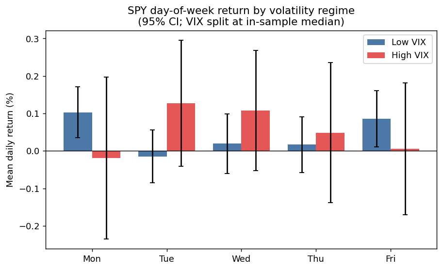
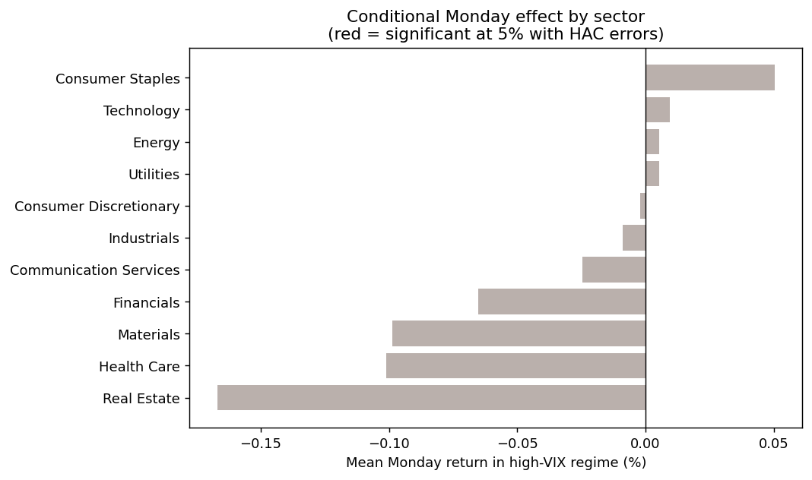
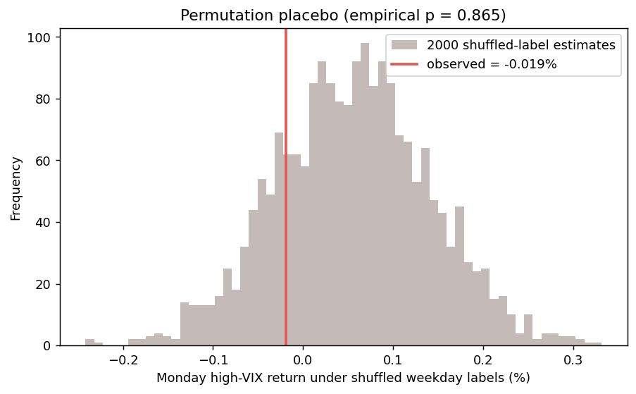
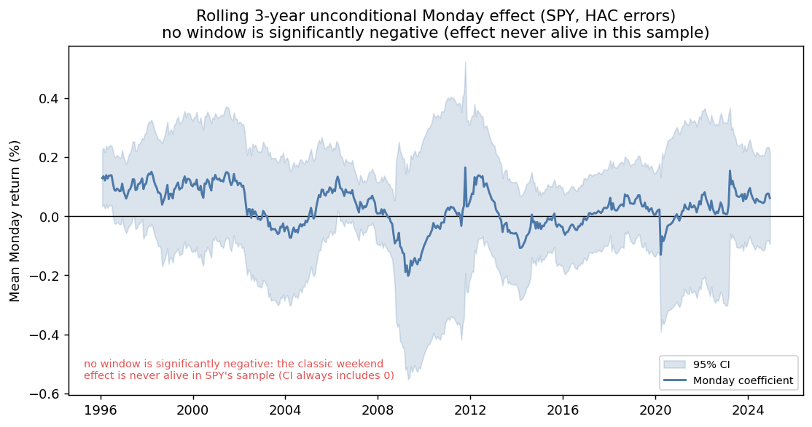
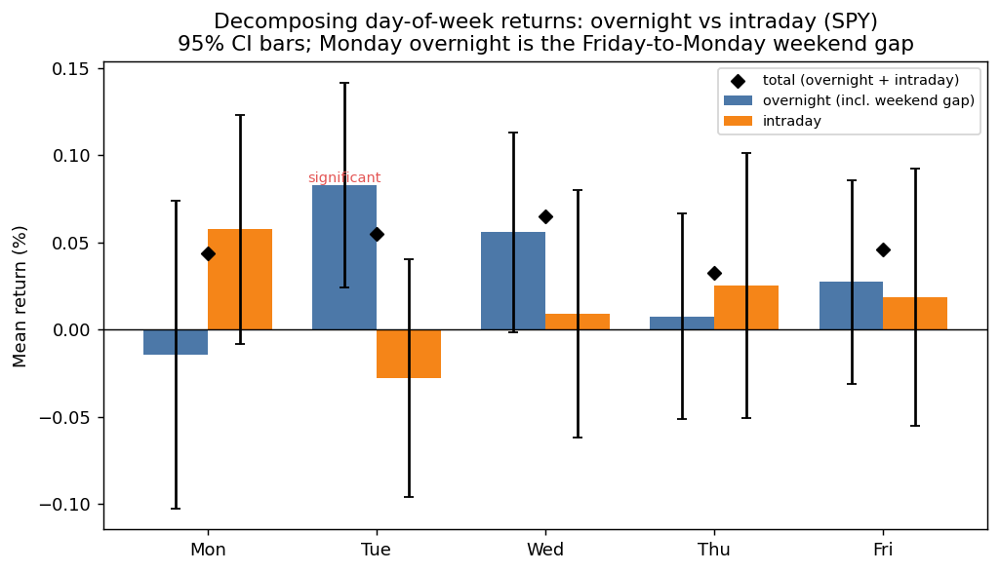

Is the "weekend effect" actually dead?

## Motivation

The weekend effect (also called the Monday effect) is one of the oldest documented calendar anomalies in finance. A calendar anomaly is a predictable, day-of-the-week pattern in returns that, in an efficient market, should not exist. French (1980) and Gibbons and Hess (1981) found that US equity returns on Mondays were reliably negative, distinct from every other weekday. The standard story is that bad news accumulates while markets are closed over the weekend, and that settlement and short-seller behavior cluster around the week boundary.

Most replications since around 2000 report that the effect has decayed to zero, arguably arbitraged away once it became common knowledge (traders bet against it until there was nothing left to exploit). But "zero on average" can hide state dependence, meaning the effect could be dead in calm markets yet reappear when volatility spikes and limits-to-arbitrage bind. Limits-to-arbitrage is just the idea that when betting against a mispricing becomes hard or risky, the mispricing can survive. This project tests exactly that.

## Hypothesis

> The unconditional Monday effect is gone post-2015, but it survives conditionally: Mondays are abnormally negative when volatility is elevated.

Volatility is measured with the VIX, often called the market's "fear gauge,h" which rises when investors expect large swings. Formally, in the interaction model below, we expect the high-VIX Monday return `beta_Mon + gamma_Mon` to be significantly negative even if `beta_Mon` alone is not.

## Data

| Series | Source | Notes |
|---|---|---|
| SPY daily closes | Yahoo Finance (`yfinance`) | market proxy (an ETF tracking the S&P 500) |
| 11 SPDR sector ETFs (XLB to XLC) | Yahoo Finance | cross-sectional disaggregation (one fund per industry) |
| CBOE VIX (`^VIX`) | Yahoo Finance | volatility-regime conditioning variable (the "fear gauge") |

- Sample: 2015-01-01 to 2025-01-01, 2,515 trading days, 29,116 asset-days.
- Returns are daily log returns in percent. Log returns are a standard way of expressing percentage changes that add up cleanly across days.
- The regime split uses the prior day's VIX close, so the conditioning variable is known before the trading day opens. This avoids look-ahead, meaning we never use information that would not have been available at the time.

No API key required; everything is public Yahoo data.

## Methodology

For each asset we estimate the following, with no intercept so that every weekday gets its own coefficient (its own clean average return) rather than being measured relative to a baseline day:

```
ret_t = Σ_d  beta_d  · D[weekday=d]_t
      + Σ_d  gamma_d · D[weekday=d]_t · HighVIX_t  +  e_t
```

- `beta_Mon` is the average Monday return in the low-VIX (calm) regime.
- `gamma_Mon` is the additional Monday return when VIX is high (the market is jittery).
- `beta_Mon + gamma_Mon` is the average Monday return in the high-VIX regime, tested as a linear contrast (a formal significance test on the two coefficients added together).

Inference uses Newey-West (HAC) standard errors (`maxlags = 5`, one trading week). In plain terms, daily returns are serially correlated and heteroskedastic (noisy in a way that clusters over time), and ordinary error bars would overstate significance and trick you into seeing patterns that are not real. Newey-West corrects for this. It is the robustness step that simpler calendar-anomaly write-ups usually skip.

Three robustness and validity layers:
1. Two regime definitions: a median VIX split (which gives balanced calm and jittery groups) and a fixed `VIX > 20` threshold (a common "elevated volatility" line). This checks the answer does not depend on an arbitrary cutoff.
2. Sector disaggregation: the same model on all 11 SPDR sectors, in case the effect concentrates in one industry and washes out in the market average.
3. Permutation placebo: the weekday labels are shuffled at random 1,000-plus times and the model re-estimated. The resulting empirical p-value guards against the multiple-comparisons trap, the danger that testing many weekday-by-regime-by-sector combinations turns up something "significant" by pure luck. If the effect appears just as easily on scrambled labels, it was never real.

A note on the p-value, since it appears throughout: it is the probability of seeing a result at least this extreme if nothing real were going on. Small values (conventionally below 0.05) are the more convincing ones.

## Findings (median split, 2015 to 2025)

The hypothesis is not supported. The weekend effect is genuinely dead, and if anything, Monday now leans slightly positive in calm markets.

| Quantity | Estimate | HAC p-value |
|---|---|---|
| Monday, low VIX  (`beta_Mon`) | +0.103% | 0.003 *** |
| Monday interaction (`gamma_Mon`) | -0.121% | 0.294 |
| Monday, high VIX (`beta_Mon+gamma_Mon`) | -0.019% | 0.865 |

(The asterisks are the usual significance shorthand: three asterisks means p below 0.01, two means below 0.05, one means below 0.10. More stars means a result less likely to be chance.)

- In calm markets Monday is reliably positive (+0.10%, p < 0.01), the opposite sign of the classic anomaly.
- The high-VIX interaction is negative as the folklore predicts, but statistically indistinguishable from zero (p = 0.29), and the net high-VIX Monday return is roughly zero.
- Sectors: Real Estate shows the most negative conditional Monday (-0.167%) but it is not significant after the HAC correction (p = 0.25). No sector clears the 5% bar.
- Placebo: the observed effect sits well inside the shuffled-label null (empirical p = 0.87), consistent with no real conditional Monday effect.

A null result, honestly reported, is the point: the conditional-survival story is intuitive, but the data do not back it over this window.





### Robustness: the result survives the regime definition

The conclusion is not an artifact of how "high volatility" is defined. Re-running the market model under a fixed `VIX > 20` threshold (instead of the median split) gives the same verdict, no significant conditional Monday effect either way:

| Regime def. | high-VIX share | Monday low-VIX | Monday interaction | Monday high-VIX |
|---|---|---|---|---|
| Median split | 50% | +0.103% (p=0.003) | -0.121% (p=0.29) | -0.019% (p=0.87) |
| `VIX > 20`   | 30% | +0.045% (p=0.27) | -0.005% (p=0.98) | +0.040% (p=0.81) |

### Dating the death: rolling Monday effect since 1993

`src/history.py` estimates the unconditional Monday return (a plain weekday average with no volatility condition) in rolling 3-year windows over SPY's entire history (1993 to 2025), 503 windows in all. The classic negative effect is never statistically significant in this sample, and the mid-1990s windows actually show a significantly positive Monday (for example, the window ending 1996-02 gives +0.13%, with a 95% confidence interval of [0.03, 0.23], meaning the plausible range for the true value sits entirely above zero).

The reading: by the time liquid, clean ETF data begins (SPY launched in January 1993) the negative weekend effect had already decayed away, consistent with the literature dating its disappearance to the 1980s as it became common knowledge. Catching the original negative effect would require pre-1993 index data such as CRSP (an academic database of long-run US stock prices) or the raw S&P series, not SPY.



### The mechanism test: is there anything in the weekend gap?

The original weekend-effect story is causal: bad news accumulates while markets are closed, so it should hit the Monday open specifically (the first moment investors can react). `src/gap.py` decomposes every weekday's return into an overnight component (prior close to open, which on Mondays is exactly the Friday-close-to-Monday-open weekend gap) and an intraday component (open to close), each tested separately with HAC errors.

| Weekday | overnight | intraday | total |
|---|---|---|---|
| Mon | -0.014% (p=0.75) | +0.058% (p=0.09) | +0.043% |
| Tue | +0.083% (p=0.006) | -0.028% | +0.055% |
| Wed | +0.056% (p=0.06) | +0.009% | +0.065% |
| Thu | +0.008% | +0.025% | +0.033% |
| Fri | +0.027% | +0.019% | +0.046% |

The weekend gap is flat (-0.014%, p=0.75): the mechanism that was supposed to drive the anomaly leaves no trace. What faint positive Monday return exists is intraday, not in the gap, the opposite of the news-accumulation hypothesis. As an aside, the strongest overnight return is Tuesday's, at +0.083% (p=0.006), an overnight drift that has nothing to do with the weekend.



## Reproduce

```bash
pip install -r requirements.txt

# Main conditional study (2015 to 2025): interaction model, regime-robustness, placebo
python src/run.py                       # median VIX split (default)
python src/run.py --regime threshold    # VIX > 20 split
python src/run.py --start 2010-01-01    # extend the window

# Dating the death: rolling unconditional Monday effect, SPY since 1993
python src/history.py                    # 3-year windows
python src/history.py --window 5         # 5-year windows

# Mechanism test: overnight (weekend gap) vs intraday decomposition
python src/gap.py
```

Data is cached to `data/panel.csv` (and `data/panel_history.csv`) after the first run; pass `--no-cache` to re-download.

## Limitations

- Pre-1993 data needed to see the live effect. The rolling analysis shows the negative Monday was already gone in SPY's lifetime; confirming when it died requires CRSP or the raw S&P index back to the 1970s and 80s. This is US large-cap only, so the effect may also persist in small-caps or non-US markets where it was originally stronger.
- Two-state regime. A binary high/low VIX split is coarse; a continuous VIX interaction or a Markov-switching model (one that lets the market move smoothly between hidden states) would be more flexible.
- No transaction costs. Even a significant 0.1% effect would likely not survive trading costs; this is a statistical exercise, not a strategy.

## Conclusion

The weekend effect is dead. Mondays are not reliably negative and the high-VIX interaction is not significant.

This is consistent with the efficient market hypothesis: once the anomaly was published and widely known, traders bet against it until the edge disappeared. A pattern that survives in academic papers rarely survives in live markets. By the time SPY data begins in 1993, the negative Monday return was already gone.

The one surprise is Tuesday. The strongest overnight return of the week is not Monday but Tuesday: +0.083%, p = 0.006. The Monday story is closed but the Tuesday story has no explanation yet.

## References

- French, K. (1980). Stock returns and the weekend effect. Journal of Financial Economics.
- Gibbons, M. and Hess, P. (1981). Day of the week effects and asset returns. Journal of Business.
- Newey, W. and West, K. (1987). A simple, positive semi-definite, heteroskedasticity and autocorrelation consistent covariance matrix. Econometrica.
